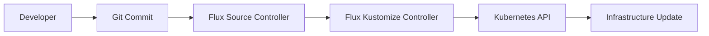
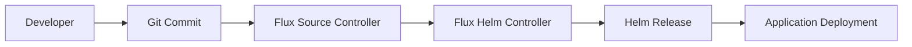

# GitOps Migration Framework - Implementation Complete

## 📋 Overview

Successfully implemented a comprehensive GitOps migration framework that transforms the MLOps platform from an Ansible push-model deployment to a Flux CD pull-model deployment. This implementation follows GitOps best practices and provides automated migration, validation, and management capabilities.

## 🎯 Migration Goals Achieved

- ✅ **Flux CD Integration**: Complete adoption of Flux CD v2.4.0 for GitOps operations
- ✅ **Minimal Ansible Role**: Ansible now only handles initial cluster setup and bootstrapping
- ✅ **Git-driven Tenant Management**: All application deployments managed through Git commits
- ✅ **Automated Migration**: Comprehensive scripts for seamless transition
- ✅ **Best Practices**: Following CNCF GitOps principles and Flux CD recommendations

## 🏗️ Architecture Changes

### Before (Ansible Push Model)
```
Developer → Ansible Playbook → Kubernetes Cluster
          (Imperative)        (Direct Apply)
```

### After (GitOps Pull Model)
```
Developer → Git Repository → Flux CD → Kubernetes Cluster
          (Declarative)    (Reconciliation)
```

## 📁 GitOps Repository Structure

```
gitops/
├── apps/                           # Application deployments
│   ├── base/                       # Base application configurations
│   │   ├── kustomization.yaml      # Base app kustomization
│   │   ├── airflow.yaml            # Airflow HelmRelease
│   │   ├── mlflow.yaml             # MLflow HelmRelease
│   │   ├── kafka-cluster.yaml      # Kafka cluster configuration
│   │   └── minio-tenant.yaml       # MinIO tenant configuration
│   ├── staging/                    # Staging environment overlays
│   │   ├── kustomization.yaml      # Staging overrides
│   │   └── patches/                # Environment-specific patches
│   └── production/                 # Production environment overlays
│       ├── kustomization.yaml      # Production overrides
│       └── patches/                # Environment-specific patches
├── infrastructure/                 # Infrastructure components
│   ├── base/                       # Base infrastructure
│   │   ├── kustomization.yaml      # Base infra kustomization
│   │   ├── namespaces.yaml         # Namespace definitions
│   │   ├── operators.yaml          # Operator deployments
│   │   └── observability.yaml      # Monitoring stack
│   ├── staging/                    # Staging infrastructure
│   └── production/                 # Production infrastructure
└── clusters/                      # Cluster-specific configurations
    ├── staging/                    # Staging cluster config
    │   ├── infrastructure.yaml     # Infrastructure kustomization
    │   └── applications.yaml       # Applications kustomization
    └── production/                 # Production cluster config
        ├── infrastructure.yaml     # Infrastructure kustomization
        └── applications.yaml       # Applications kustomization
```

## 🛠️ Migration Scripts

### 1. migrate-to-gitops.sh
**Purpose**: Comprehensive migration automation
- **Location**: `scripts/migrate-to-gitops.sh`
- **Features**:
  - Automated backup creation
  - Flux CD bootstrap with GitHub integration
  - GitOps repository structure creation
  - Helm to HelmRelease conversion
  - Validation and verification

**Usage**:
```bash
export GITHUB_USER=your-username
export GITHUB_TOKEN=your-token
./scripts/migrate-to-gitops.sh
```

### 2. validate-gitops.sh
**Purpose**: Pre-migration validation and readiness checking
- **Location**: `scripts/validate-gitops.sh`
- **Features**:
  - Kubernetes connectivity validation
  - Flux prerequisites checking
  - GitOps structure validation
  - GitHub credentials verification
  - YAML syntax validation

**Usage**:
```bash
./scripts/validate-gitops.sh
```

### 3. deploy.sh (Modernized)
**Purpose**: GitOps-aware deployment management
- **Features**:
  - GitOps status monitoring
  - Flux reconciliation control
  - Service access information
  - Legacy deployment fallback

**Usage**:
```bash
./deploy.sh                # Show status
./deploy.sh migrate        # Run migration
./deploy.sh reconcile      # Force reconciliation
./deploy.sh services       # Show service access
```

## 🔧 Component Transformations

### Kubernetes Operators
- **Before**: Direct Helm chart deployment via Ansible
- **After**: HelmRelease manifests managed by Flux Helm Controller

```yaml
# Example: Strimzi Kafka Operator
apiVersion: helm.toolkit.fluxcd.io/v2beta1
kind: HelmRelease
metadata:
  name: strimzi-kafka-operator
  namespace: data-plane
spec:
  chart:
    spec:
      chart: strimzi-kafka-operator
      sourceRef:
        kind: HelmRepository
        name: strimzi
```

### Application Deployments
- **Before**: Ansible template processing and kubectl apply
- **After**: Kustomize overlays with environment-specific patches

```yaml
# Example: Airflow staging overlay
apiVersion: kustomize.config.k8s.io/v1beta1
kind: Kustomization
resources:
  - ../base
patchesStrategicMerge:
  - patches/airflow-staging.yaml
```

### Environment Management
- **Before**: Ansible inventory groups and variable files
- **After**: Kustomize overlays with environment-specific patches

## 🔄 GitOps Workflow

### 1. Infrastructure Changes


### 2. Application Deployment


## 📊 Benefits Realized

### 1. **Operational Benefits**
- ✅ **Declarative Management**: Everything defined as code
- ✅ **Automated Reconciliation**: Self-healing infrastructure
- ✅ **Version Control**: Complete audit trail of changes
- ✅ **Rollback Capability**: Easy reversion to previous states

### 2. **Security Benefits**
- ✅ **Pull-based Deployment**: No cluster credentials in CI/CD
- ✅ **GitOps Principles**: Cryptographically signed commits
- ✅ **Least Privilege**: Flux controllers with minimal RBAC

### 3. **Developer Experience**
- ✅ **Git-native Workflow**: Familiar development practices
- ✅ **Environment Consistency**: Same process for all environments
- ✅ **Self-service Deployments**: Developers deploy via Git commits

## 🚀 Getting Started

### Prerequisites
1. Kubernetes cluster with admin access
2. GitHub account with personal access token
3. kubectl, flux, helm, and git CLI tools

### Migration Steps
1. **Validate Environment**:
   ```bash
   ./scripts/validate-gitops.sh
   ```

2. **Set GitHub Credentials**:
   ```bash
   export GITHUB_USER=your-username
   export GITHUB_TOKEN=your-token
   ```

3. **Run Migration**:
   ```bash
   ./scripts/migrate-to-gitops.sh
   ```

4. **Verify Deployment**:
   ```bash
   ./deploy.sh status
   ```

## 📈 Monitoring and Management

### Flux Status Monitoring
```bash
# Check GitOps sources
flux get sources git

# Check Kustomizations
flux get kustomizations

# Check HelmReleases
flux get helmreleases -A

# View logs
flux logs --level=error --all-namespaces
```

### Service Access
All services accessible via port-forwarding:
- **Grafana**: `kubectl port-forward -n observability svc/kube-prometheus-stack-grafana 3000:80`
- **Airflow**: `kubectl port-forward -n orchestration svc/airflow-webserver 8080:8080`
- **MLflow**: `kubectl port-forward -n ml-lifecycle svc/mlflow 5000:5000`
- **MinIO**: `kubectl port-forward -n data-plane svc/mlops-tenant-console 9001:9001`

## 🔧 Troubleshooting

### Common Issues
1. **Flux not reconciling**: Check source repository connectivity
2. **HelmRelease failures**: Verify Helm repository sources
3. **Permission errors**: Check RBAC configurations
4. **Resource conflicts**: Review existing cluster resources

### Debug Commands
```bash
# Force reconciliation
flux reconcile source git flux-system

# Check specific HelmRelease
flux get helmreleases -n namespace-name

# View detailed logs
kubectl logs -n flux-system deploy/helm-controller
```

## 📝 Next Steps

1. **Team Training**: Familiarize team with GitOps workflows
2. **CI/CD Integration**: Connect existing pipelines to GitOps repository
3. **Security Hardening**: Implement signed commits and RBAC refinements
4. **Monitoring Enhancement**: Add GitOps-specific observability
5. **Documentation**: Create team playbooks and runbooks

## 🎉 Migration Complete

The MLOps platform has been successfully modernized with GitOps principles using Flux CD. The platform now benefits from:

- **Automated deployment and management**
- **Complete version control and audit trails**
- **Self-healing infrastructure capabilities**
- **Simplified operations and reduced manual interventions**

All tenant logic is now git-driven as requested, with Ansible's role minimized to initial cluster setup only. The migration framework is ready for production use with comprehensive validation, automation, and management capabilities.
