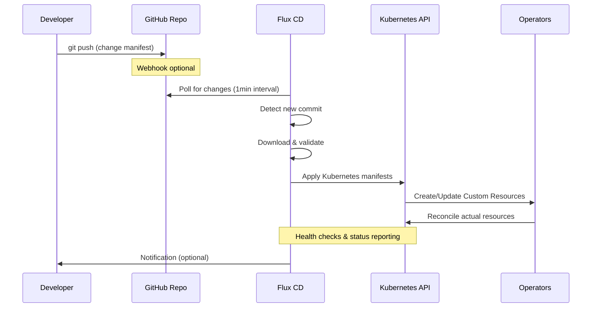

# GitOps Deep Dive: Technical Implementation Guide

## 🔧 GitOps Architecture in Detail

### Flux CD Components

This platform uses **Flux CD v2**, which consists of four specialized controllers running as Kubernetes containers:

```yaml
Flux CD Architecture:
┌─────────────────────────────────────────────────────────────┐
│                    flux-system namespace                   │
├─────────────────────────────────────────────────────────────┤
│  Source Controller     │  Tracks Git repos, Helm repos     │
│  Kustomize Controller  │  Applies Kubernetes manifests     │
│  Helm Controller       │  Manages Helm releases            │
│  Notification Controller│  Sends alerts and webhooks       │
└─────────────────────────────────────────────────────────────┘
```

### 1. Source Controller
**Purpose**: Monitors and fetches source code from various origins

```yaml
# GitRepository Resource Example
apiVersion: source.toolkit.fluxcd.io/v1
kind: GitRepository
metadata:
  name: mlops-infrastructure
  namespace: flux-system
spec:
  interval: 1m                    # Check for changes every minute
  ref:
    branch: main
  url: https://github.com/USER/MLOpsInfrastructure
  timeout: 60s
```

**Key Features**:
- **Artifact Storage**: Downloads and stores Git content as compressed archives
- **Verification**: Supports GPG signature verification for security
- **Caching**: Efficient bandwidth usage with conditional requests
- **Multi-source**: Can track multiple repositories simultaneously

### 2. Kustomize Controller
**Purpose**: Applies and manages Kubernetes manifests using Kustomize

```yaml
# Kustomization Resource Example
apiVersion: kustomize.toolkit.fluxcd.io/v1
kind: Kustomization
metadata:
  name: mlops-platform-base
  namespace: flux-system
spec:
  interval: 1m
  path: "./gitops/base"
  prune: true                     # Remove resources not in Git
  sourceRef:
    kind: GitRepository
    name: mlops-infrastructure
  timeout: 5m
  wait: true                      # Wait for resources to be ready
  healthChecks:                   # Define custom health checks
    - apiVersion: v1
      kind: Namespace
      name: platform-operators
```

**Advanced Features**:
- **Dependency Management**: Ensures resources are applied in correct order
- **Health Checking**: Validates that resources are actually healthy
- **Pruning**: Removes resources deleted from Git (garbage collection)
- **Post-build Substitution**: Dynamic value injection at runtime

### 3. Helm Controller
**Purpose**: Manages Helm releases declaratively

```yaml
# HelmRelease Resource Example
apiVersion: helm.toolkit.fluxcd.io/v2beta1
kind: HelmRelease
metadata:
  name: strimzi-kafka-operator
  namespace: platform-operators
spec:
  interval: 5m
  chart:
    spec:
      chart: strimzi-kafka-operator
      version: "0.43.0"
      sourceRef:
        kind: HelmRepository
        name: strimzi
  values:                         # Override default values
    watchAnyNamespace: false
    defaultImageRegistry: quay.io
  upgrade:
    remediation:
      retries: 3                  # Retry failed upgrades
  rollback:
    cleanupOnFail: true
```

## 🔄 GitOps Workflow Deep Dive

### End-to-End Flow



### Reconciliation Process

#### 1. **Source Reconciliation**
```bash
# Every minute, Flux checks:
# 1. Has the Git repository changed?
# 2. Download new commits if available
# 3. Verify integrity and signatures
# 4. Store as compressed artifact

kubectl describe gitrepository mlops-infrastructure -n flux-system
```

#### 2. **Kustomize Reconciliation**
```bash
# For each Kustomization:
# 1. Extract source artifact
# 2. Run kustomize build on specified path
# 3. Apply resulting manifests to cluster
# 4. Wait for resources to become ready
# 5. Run health checks

kubectl describe kustomization mlops-platform-base -n flux-system
```

#### 3. **Helm Reconciliation**
```bash
# For each HelmRelease:
# 1. Fetch Helm chart from repository
# 2. Render templates with values
# 3. Compare with current release state
# 4. Upgrade if changes detected
# 5. Validate deployment success

kubectl describe helmrelease strimzi-kafka-operator -n platform-operators
```

## 🛡️ Security Model

### GitOps Security Benefits

#### 1. **Least Privilege Access**
```yaml
# Developers need only Git access, not cluster access
Principle: 
  - Developers: Git repository write access
  - Flux CD: Kubernetes cluster admin (automated)
  - Production: No human kubectl access required
```

#### 2. **Audit Trail**
```bash
# Every change is tracked in Git
git log --oneline --graph gitops/

# Example output:
# * a1b2c3d Deploy new Kafka topic configuration
# * e4f5g6h Update MinIO storage class to SSD
# * h7i8j9k Add network policies for security
```

#### 3. **Change Review Process**
```yaml
GitHub Workflow:
  1. Developer creates feature branch
  2. Makes infrastructure changes
  3. Opens Pull Request
  4. Team reviews changes
  5. Automated CI validates manifests
  6. Merge triggers deployment
  7. Flux applies to cluster automatically
```

### Authentication & Authorization

#### Flux CD Service Account
```yaml
# Flux runs with dedicated service account
apiVersion: v1
kind: ServiceAccount
metadata:
  name: kustomize-controller
  namespace: flux-system
---
# Bound to cluster-admin role (required for CRD management)
apiVersion: rbac.authorization.k8s.io/v1
kind: ClusterRoleBinding
metadata:
  name: flux-cluster-admin
roleRef:
  apiGroup: rbac.authorization.k8s.io
  kind: ClusterRole
  name: cluster-admin
subjects:
- kind: ServiceAccount
  name: kustomize-controller
  namespace: flux-system
```

#### Application-Level RBAC
```yaml
# Each application gets minimal required permissions
apiVersion: v1
kind: ServiceAccount
metadata:
  name: spark-job-runner
  namespace: processing-jobs
---
apiVersion: rbac.authorization.k8s.io/v1
kind: Role
metadata:
  name: spark-executor
  namespace: processing-jobs
rules:
- apiGroups: [""]
  resources: ["pods"]
  verbs: ["create", "delete", "get", "list"]
```

## 📊 Monitoring & Observability

### GitOps Metrics

Flux CD exposes Prometheus metrics for monitoring:

```yaml
# Key metrics to monitor:
flux_source_controller_git_repository_conditions_total
flux_kustomize_controller_kustomization_conditions_total
flux_helm_controller_helm_release_conditions_total

# Alerts to configure:
- GitRepository sync failures
- Kustomization reconciliation errors
- HelmRelease upgrade failures
- Drift detection events
```

### Status Checking

#### Real-time Status Commands
```bash
# Overall GitOps health
flux get all

# Detailed source status
flux get sources git

# Check specific Kustomization
kubectl describe kustomization mlops-platform-base -n flux-system

# Monitor reconciliation in real-time
kubectl get kustomization -n flux-system -w
```

#### Health Check Implementation
```yaml
# In Kustomization spec:
healthChecks:
  # Check namespace exists and is active
  - apiVersion: v1
    kind: Namespace
    name: data-plane
  
  # Check deployment is ready
  - apiVersion: apps/v1
    kind: Deployment
    name: strimzi-cluster-operator
    namespace: platform-operators
  
  # Check custom resource is ready
  - apiVersion: kafka.strimzi.io/v1beta2
    kind: Kafka
    name: mlops-kafka-cluster
    namespace: data-plane
```

## 🔧 Advanced GitOps Patterns

### 1. Multi-Environment Management

```yaml
# Directory structure for environments:
gitops/
├── base/                    # Common resources
├── environments/
│   ├── development/
│   │   ├── kustomization.yaml
│   │   └── patches/
│   ├── staging/
│   │   ├── kustomization.yaml
│   │   └── patches/
│   └── production/
│       ├── kustomization.yaml
│       └── patches/
```

### 2. Progressive Delivery

```yaml
# Canary deployment with Flagger
apiVersion: flagger.app/v1beta1
kind: Canary
metadata:
  name: mlflow-server
  namespace: ml-lifecycle
spec:
  targetRef:
    apiVersion: apps/v1
    kind: Deployment
    name: mlflow-server
  progressDeadlineSeconds: 60
  service:
    port: 5000
  analysis:
    interval: 1m
    threshold: 5
    maxWeight: 50
    stepWeight: 10
    metrics:
    - name: request-success-rate
      threshold: 99
      interval: 1m
```

### 3. Secret Management

```yaml
# External Secrets Operator integration
apiVersion: external-secrets.io/v1beta1
kind: SecretStore
metadata:
  name: vault-backend
  namespace: ml-lifecycle
spec:
  provider:
    vault:
      server: "https://vault.company.com"
      path: "secret"
      version: "v2"
      auth:
        kubernetes:
          mountPath: "kubernetes"
          role: "mlops-secrets"
---
apiVersion: external-secrets.io/v1beta1
kind: ExternalSecret
metadata:
  name: mlflow-db-credentials
  namespace: ml-lifecycle
spec:
  refreshInterval: 5m
  secretStoreRef:
    name: vault-backend
    kind: SecretStore
  target:
    name: mlflow-postgres-secret
    creationPolicy: Owner
  data:
  - secretKey: password
    remoteRef:
      key: mlflow/database
      property: password
```

## 🚀 Performance Optimization

### Flux CD Tuning

#### 1. **Reconciliation Intervals**
```yaml
# Balance between freshness and performance
GitRepository:
  interval: 1m          # Fast feedback for development
  # interval: 5m        # Production: reduce API calls

Kustomization:
  interval: 10m         # Infrastructure changes are less frequent
  timeout: 5m           # Prevent hanging on large deployments

HelmRelease:
  interval: 5m          # Helm operations are heavier
  timeout: 10m          # Allow time for complex charts
```

#### 2. **Resource Optimization**
```yaml
# Flux controller resource limits
resources:
  limits:
    cpu: 1000m
    memory: 1Gi
  requests:
    cpu: 100m
    memory: 64Mi

# For large clusters, increase resources:
resources:
  limits:
    cpu: 2000m
    memory: 2Gi
  requests:
    cpu: 500m
    memory: 512Mi
```

### Scaling Considerations

#### 1. **Repository Size**
```bash
# Keep repositories focused and lightweight
# Recommended: < 100 MB per repository
# Use multiple repositories for large platforms

git clone --depth 1 <repo>  # Shallow clones for CI
```

#### 2. **Manifest Organization**
```yaml
# Split large Kustomizations into smaller ones
# Benefits:
#   - Faster reconciliation
#   - Better isolation
#   - Parallel processing
#   - Easier troubleshooting

# Example split:
kustomizations:
  - mlops-platform-base      # Namespaces, RBAC
  - mlops-operators         # Platform operators
  - mlops-data-services     # Kafka, MinIO
  - mlops-ml-services       # MLflow, Airflow
```

## 🔍 Troubleshooting Guide

### Common GitOps Issues

#### 1. **Source Controller Problems**
```bash
# Symptoms: GitRepository shows failed condition
# Check logs:
kubectl logs -n flux-system -l app=source-controller

# Common causes:
# - Repository access denied
# - Network connectivity issues
# - Invalid Git URL
# - Branch doesn't exist

# Solutions:
# - Verify repository URL and branch
# - Check network policies
# - Validate authentication credentials
```

#### 2. **Kustomize Controller Issues**
```bash
# Symptoms: Kustomization fails to apply
# Check logs:
kubectl logs -n flux-system -l app=kustomize-controller

# Common causes:
# - Invalid YAML syntax
# - Missing CRDs
# - Resource conflicts
# - Insufficient permissions

# Debug approach:
# 1. Validate locally:
kustomize build gitops/base

# 2. Check for syntax errors:
kubectl apply --dry-run=client -f gitops/base/

# 3. Review resource dependencies
kubectl describe kustomization <name> -n flux-system
```

#### 3. **Helm Controller Problems**
```bash
# Symptoms: HelmRelease fails to install/upgrade
# Check logs:
kubectl logs -n flux-system -l app=helm-controller

# Common causes:
# - Chart repository unreachable
# - Invalid values configuration
# - Resource conflicts
# - Timeout issues

# Debug steps:
# 1. Test chart manually:
helm template <release> <chart> --values <values-file>

# 2. Check Helm repository:
kubectl get helmrepository -A

# 3. Review release history:
kubectl describe helmrelease <name> -n <namespace>
```

### Recovery Procedures

#### 1. **Drift Recovery**
```bash
# Force reconciliation to fix drift
flux reconcile kustomization mlops-platform-base

# Or restart controllers
kubectl rollout restart deployment -n flux-system
```

#### 2. **Rollback Procedures**
```bash
# Method 1: Git revert
git revert <commit-hash>
git push origin main

# Method 2: Suspend and manual fix
flux suspend kustomization mlops-platform-base
kubectl apply -f backup-manifests/
flux resume kustomization mlops-platform-base
```

#### 3. **Emergency Recovery**
```bash
# Complete GitOps reset
flux uninstall --namespace=flux-system

# Redeploy from bootstrap
./scripts/bootstrap-gitops-latest.sh
```

## 📈 Best Practices

### 1. **Repository Management**
- ✅ Keep GitOps configs in a dedicated repository or clear directory structure
- ✅ Use semantic versioning for releases
- ✅ Implement branch protection rules
- ✅ Require code reviews for changes
- ❌ Don't store secrets in Git (use external secret management)

### 2. **Manifest Organization**
- ✅ Group related resources in the same Kustomization
- ✅ Use clear, descriptive names for resources
- ✅ Implement proper labeling strategy
- ✅ Document dependencies between components
- ❌ Don't create circular dependencies

### 3. **Monitoring & Alerting**
- ✅ Monitor GitOps controller health
- ✅ Alert on reconciliation failures
- ✅ Track deployment metrics
- ✅ Implement drift detection alerts
- ❌ Don't ignore warning events

### 4. **Security**
- ✅ Use least privilege access
- ✅ Implement proper RBAC
- ✅ Regular security audits
- ✅ Encrypt sensitive data
- ❌ Don't bypass the GitOps process for "quick fixes"

---

This deep technical guide complements the main platform documentation, providing the detailed knowledge needed to operate and extend the GitOps implementation effectively.
