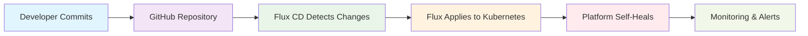

# MLOps Infrastructure Platform: Complete Guide

## 🚀 Overview

This repository provides a **production-ready, cloud-native MLOps platform** built on Kubernetes using modern GitOps principles. The platform enables end-to-end machine learning workflows from data ingestion to model deployment, with automated orchestration, monitoring, and lifecycle management.

### 🎯 Key Capabilities

- **🔄 GitOps-Driven Operations**: Declarative infrastructure management with automatic drift detection and remediation
- **📊 End-to-End ML Pipelines**: Complete workflow orchestration from data processing to model deployment
- **⚖️ Auto-Scaling & Resource Management**: Dynamic resource allocation for ML workloads
- **🛡️ Enterprise Security**: RBAC, network policies, and secure secret management
- **📈 Observability**: Comprehensive monitoring, logging, and alerting
- **🔧 Operator-Based Management**: Self-healing infrastructure with minimal operational overhead

## 🏗️ Architecture Overview

The platform is organized into **six logical layers**, each deployed in dedicated Kubernetes namespaces:

```
┌─────────────────────────────────────────────────────────────┐
│                    GitOps Control Plane                    │
│                   (flux-system namespace)                  │
└─────────────────────────────────────────────────────────────┘
┌─────────────────────────────────────────────────────────────┐
│               Platform Operators Layer                     │
│            (platform-operators namespace)                  │
│    • Strimzi Kafka Operator  • MinIO Operator             │
│    • Spark Operator          • Observability Stack        │
└─────────────────────────────────────────────────────────────┘
┌─────────────────────────────────────────────────────────────┐
│                Data & Storage Layer                        │
│              (data-plane namespace)                        │
│    • Apache Kafka Cluster    • MinIO Object Storage       │
└─────────────────────────────────────────────────────────────┘
┌─────────────────────────────────────────────────────────────┐
│               Orchestration Layer                          │
│             (orchestration namespace)                      │
│    • Apache Airflow          • PostgreSQL                 │
│    • Redis                   • Worker Pools               │
└─────────────────────────────────────────────────────────────┘
┌─────────────────────────────────────────────────────────────┐
│              ML Lifecycle Layer                            │
│             (ml-lifecycle namespace)                       │
│    • MLflow Tracking Server  • Model Registry             │
│    • Experiment Database     • Artifact Storage           │
└─────────────────────────────────────────────────────────────┘
┌─────────────────────────────────────────────────────────────┐
│               Processing Layer                              │
│            (processing-jobs namespace)                     │
│    • Dynamic Spark Jobs      • Flink Applications         │
│    • Model Training Pods     • Feature Engineering        │
└─────────────────────────────────────────────────────────────┘
```

### Core Components

| Component | Purpose | Technology | Namespace |
|-----------|---------|------------|-----------|
| **GitOps Controller** | Infrastructure automation | Flux CD v2 | flux-system |
| **Message Streaming** | Real-time data processing | Apache Kafka (Strimzi) | data-plane |
| **Object Storage** | Data lake & artifacts | MinIO (S3-compatible) | data-plane |
| **Workflow Orchestration** | Pipeline automation | Apache Airflow | orchestration |
| **ML Lifecycle Management** | Experiment tracking | MLflow | ml-lifecycle |
| **Batch Processing** | Large-scale data processing | Apache Spark | processing-jobs |
| **Stream Processing** | Real-time analytics | Apache Flink | processing-jobs |
| **Observability** | Monitoring & alerting | Prometheus, Grafana | observability |

## 🔄 GitOps Operations & Benefits

### What is GitOps?

GitOps is a modern operational framework where:
- **Git is the single source of truth** for both application and infrastructure code
- **Declarative configurations** define the desired state of the entire system
- **Automated agents** continuously monitor and reconcile actual state with desired state
- **All changes** go through Git workflows (pull requests, reviews, approvals)

### How GitOps Works in This Platform



#### 1. **Repository Structure**
```
mlops-platform/
├── gitops/                    # GitOps configurations
│   ├── base/                  # Foundation resources
│   │   ├── namespaces.yaml    # Namespace definitions
│   │   └── rbac.yaml          # Security policies
│   └── components/            # Application deployments
│       ├── strimzi-operator.yaml
│       ├── minio-operator.yaml
│       └── spark-operator.yaml
├── infrastructure/            # Traditional IaC (Helm values)
└── scripts/                   # Bootstrap & utilities
```

#### 2. **Flux CD Reconciliation Loop**
- **Source Controller**: Monitors Git repository for changes every 1 minute
- **Kustomize Controller**: Applies Kubernetes manifests from gitops/ directory
- **Helm Controller**: Manages Helm releases for complex applications
- **Notification Controller**: Sends alerts about deployment status

#### 3. **Automatic Drift Detection**
- Flux continuously compares actual cluster state vs. Git definitions
- **Self-healing**: If someone manually changes resources, Flux reverts them
- **Immediate updates**: Changes pushed to Git are applied within 1 minute

### GitOps Benefits for MLOps

#### 🔒 **Enhanced Security**
- **Audit trail**: Every change tracked in Git history
- **Role-based access**: Infrastructure changes require code review
- **No direct cluster access**: Developers work through Git workflows
- **Secret management**: Sensitive data handled through Kubernetes secrets

#### 📈 **Improved Reliability**
- **Declarative state**: Infrastructure is code, versioned and reproducible
- **Automated rollbacks**: Easy reversion to previous working states
- **Drift prevention**: System maintains desired configuration automatically
- **Disaster recovery**: Complete cluster recreation from Git repository

#### ⚡ **Faster Development Cycles**
- **Continuous deployment**: Automatic application of approved changes
- **Environment parity**: Same GitOps process for dev, staging, and production
- **Parallel development**: Multiple teams can work on different components
- **Quick iterations**: Instant feedback loop for infrastructure changes

#### 🎯 **Operational Excellence**
- **Reduced manual errors**: No manual kubectl commands in production
- **Consistent deployments**: Same process across all environments
- **Simplified operations**: Operators handle complex stateful workloads
- **Scalable management**: Platform grows without operational overhead

## 📋 Prerequisites

Before setting up the platform, ensure you have:

### Required Software
- **Kubernetes cluster** (v1.24+)
  - Local: Docker Desktop, Minikube, or kind
  - Cloud: EKS, GKE, AKS
- **kubectl** CLI tool
- **Git** for version control
- **Docker** for container operations

### Recommended Resources
```yaml
Minimum Cluster Requirements:
  Nodes: 3 (for HA)
  CPU: 8 cores total
  Memory: 16 GB total
  Storage: 100 GB available

Production Cluster Recommendations:
  Nodes: 6+ (for workload isolation)
  CPU: 24+ cores total
  Memory: 64+ GB total
  Storage: 500+ GB SSD
```

### Required Permissions
- **Cluster admin** access for initial setup
- **Git repository** access (read permissions for Flux)
- **Container registry** access (if using private images)

## 🛠️ Step-by-Step Setup Guide

### Step 1: Clone the Repository

```bash
# Clone the repository
git clone https://github.com/YourUsername/MLOpsInfrastructure.git
cd MLOpsInfrastructure

# Verify Kubernetes connectivity
kubectl cluster-info
kubectl get nodes
```

### Step 2: Configure Environment Variables

Create a configuration file for your environment:

```bash
# Create environment configuration
cat > .env << 'EOF'
# GitHub Configuration
export GITHUB_USER="YourGitHubUsername"
export GITHUB_REPO="MLOpsInfrastructure"
export GITHUB_BRANCH="main"

# Flux Configuration
export FLUX_NAMESPACE="flux-system"

# Platform Configuration
export PLATFORM_DOMAIN="your-domain.com"  # Optional: for ingress configuration
export ENVIRONMENT="production"           # or "staging", "development"

# Resource Configuration
export ENABLE_MONITORING="true"          # Deploy observability stack
export ENABLE_AUTOSCALING="true"         # Enable horizontal pod autoscaling
export STORAGE_CLASS="standard"          # Kubernetes storage class name
EOF

# Load environment variables
source .env
```

### Step 3: Customize Configuration (Optional)

Review and modify the default configurations:

```bash
# Review namespace configuration
cat gitops/base/namespaces.yaml

# Review RBAC settings
cat gitops/base/rbac.yaml

# Check operator configurations
ls gitops/components/
```

**Key customization points:**
- Resource limits in operator configurations
- Storage classes for persistent volumes
- Network policies for security
- Monitoring and alerting thresholds

### Step 4: Bootstrap the Platform

Run the automated bootstrap script:

```bash
# Make the script executable
chmod +x scripts/bootstrap-gitops-latest.sh

# Run the bootstrap process
./scripts/bootstrap-gitops-latest.sh
```

**What this script does:**
1. ✅ Validates prerequisites and cluster connectivity
2. ✅ Installs Flux CD controllers as Kubernetes containers
3. ✅ Creates MLOps platform namespaces
4. ✅ Sets up RBAC and service accounts
5. ✅ Configures GitRepository source pointing to your repo
6. ✅ Creates Kustomizations for automated deployment
7. ✅ Deploys platform operators (Strimzi, MinIO, Spark)
8. ✅ Verifies deployment status and health checks

### Step 5: Verify Deployment

Check the platform status:

```bash
# Monitor GitOps reconciliation
kubectl get kustomization -n flux-system -w

# Check all platform namespaces
kubectl get namespaces | grep -E "(platform-operators|data-plane|orchestration|ml-lifecycle|processing-jobs|observability)"

# Verify operators are running
kubectl get deployments -n platform-operators

# Check Flux system health
kubectl get pods -n flux-system
```

### Step 6: Deploy Core Applications

The operators are now running. Deploy the actual Kafka cluster and MinIO tenant:

```bash
# Deploy Kafka cluster
kubectl apply -f infrastructure/manifests/kafka/kafka-cluster.yaml

# Deploy MinIO tenant
kubectl apply -f infrastructure/manifests/minio/minio-tenant.yaml

# Monitor deployment
kubectl get kafka -n data-plane
kubectl get tenant -n data-plane
```

### Step 7: Access Platform Services

Get service endpoints:

```bash
# Get Kafka bootstrap servers
kubectl get kafka mlops-kafka-cluster -n data-plane -o jsonpath='{.status.listeners[0].bootstrapServers}'

# Get MinIO console URL (if ingress is configured)
kubectl get ingress -n data-plane

# Get MLflow tracking server URL
kubectl get service -n ml-lifecycle mlflow-service
```

## 🔧 Environment Variables Reference

### Required Variables

| Variable | Description | Example Value | Required |
|----------|-------------|---------------|----------|
| `GITHUB_USER` | GitHub username/organization | `john-doe` | ✅ Yes |
| `GITHUB_REPO` | Repository name | `MLOpsInfrastructure` | ✅ Yes |
| `GITHUB_BRANCH` | Git branch to track | `main` | ✅ Yes |

### Optional Variables

| Variable | Description | Default Value | Purpose |
|----------|-------------|---------------|---------|
| `FLUX_NAMESPACE` | Flux system namespace | `flux-system` | GitOps isolation |
| `PLATFORM_DOMAIN` | Base domain for ingress | `localhost` | External access |
| `ENVIRONMENT` | Deployment environment | `production` | Resource sizing |
| `STORAGE_CLASS` | Kubernetes storage class | `standard` | Persistent volumes |
| `ENABLE_MONITORING` | Deploy observability | `true` | Monitoring stack |
| `ENABLE_AUTOSCALING` | Enable HPA | `true` | Auto-scaling |

### Advanced Configuration

For production deployments, consider these additional variables:

```bash
# Security
export TLS_ENABLED="true"
export NETWORK_POLICIES_ENABLED="true"

# Performance
export KAFKA_REPLICAS="3"
export MINIO_SERVERS="4"
export SPARK_EXECUTOR_INSTANCES="3"

# Monitoring
export PROMETHEUS_RETENTION="30d"
export GRAFANA_ADMIN_PASSWORD="your-secure-password"

# Backup
export BACKUP_ENABLED="true"
export BACKUP_SCHEDULE="0 2 * * *"
```

## 🚀 Making Changes with GitOps

### Adding a New Component

1. **Create the configuration:**
```bash
# Add a new HelmRelease for Redis
cat > gitops/components/redis-operator.yaml << 'EOF'
apiVersion: helm.toolkit.fluxcd.io/v2beta1
kind: HelmRelease
metadata:
  name: redis-operator
  namespace: platform-operators
spec:
  interval: 5m
  chart:
    spec:
      chart: redis-operator
      version: "1.2.4"
      sourceRef:
        kind: HelmRepository
        name: redis-repo
  values:
    replicaCount: 1
EOF
```

2. **Update Kustomization:**
```bash
# Add to gitops/components/kustomization.yaml
echo "  - redis-operator.yaml" >> gitops/components/kustomization.yaml
```

3. **Commit and push:**
```bash
git add gitops/components/
git commit -m "Add Redis operator for caching"
git push origin main
```

4. **Monitor deployment:**
```bash
# Changes will be applied automatically within 1 minute
kubectl get kustomization -n flux-system -w
```

### Updating Component Versions

1. **Edit the HelmRelease:**
```bash
# Update Kafka operator version
sed -i 's/version: "0.43.0"/version: "0.44.0"/' gitops/components/strimzi-operator.yaml
```

2. **Commit the change:**
```bash
git add gitops/components/strimzi-operator.yaml
git commit -m "Update Strimzi operator to v0.44.0"
git push origin main
```

3. **Flux will automatically:**
   - Detect the change
   - Download the new Helm chart
   - Perform a rolling update
   - Report status via Kubernetes events

## 📊 Platform Operations

### Monitoring GitOps Health

```bash
# Check GitRepository sync status
kubectl describe gitrepository mlops-infrastructure -n flux-system

# Monitor all Kustomizations
kubectl get kustomization -n flux-system

# View Flux controller logs
kubectl logs -n flux-system -l app=kustomize-controller --tail=50
```

### Common Operations

#### Pause/Resume GitOps
```bash
# Pause reconciliation
kubectl patch gitrepository mlops-infrastructure -n flux-system -p '{"spec":{"suspend":true}}'

# Resume reconciliation
kubectl patch gitrepository mlops-infrastructure -n flux-system -p '{"spec":{"suspend":false}}'
```

#### Force Reconciliation
```bash
# Trigger immediate sync
kubectl annotate gitrepository mlops-infrastructure -n flux-system \
  reconcile.fluxcd.io/requestedAt="$(date +%s)"
```

#### Rollback Changes
```bash
# Revert to previous Git commit
git revert HEAD
git push origin main
# Flux will automatically apply the rollback
```

### Troubleshooting

#### Common Issues

1. **Repository access denied:**
   - Verify repository is public or configure SSH/token authentication
   - Check GitHub repository URL and permissions

2. **Kustomization failures:**
   - Review kustomization logs: `kubectl logs -n flux-system -l app=kustomize-controller`
   - Validate YAML syntax in gitops/ directory

3. **Operator deployment issues:**
   - Check operator logs: `kubectl logs -n platform-operators -l app=strimzi`
   - Verify resource quotas and node capacity

#### Debug Commands

```bash
# Get overall platform status
./scripts/bootstrap-gitops-latest.sh status

# Check resource usage
kubectl top nodes
kubectl top pods -A

# Examine failed pods
kubectl get pods -A | grep -E "(Error|CrashLoopBackOff|Pending)"

# View detailed events
kubectl get events --sort-by='.lastTimestamp' -A
```

## 🎯 Next Steps

After successful deployment, explore these advanced topics:

### 1. **Deploy Sample ML Pipeline**
```bash
# Run the demo workflow
./scripts/run-mlops-demo.sh
```

### 2. **Set Up Monitoring**
```bash
# Deploy observability stack
kubectl apply -f gitops/components/observability/
```

### 3. **Configure External Access**
```bash
# Set up ingress controllers
kubectl apply -f infrastructure/manifests/ingress/
```

### 4. **Implement CI/CD**
- Configure GitHub Actions for automated testing
- Set up multi-environment promotions
- Implement automated model deployment

### 5. **Security Hardening**
- Enable network policies
- Configure TLS certificates
- Implement pod security standards

## 📚 Additional Resources

- **[GitOps Documentation](docs/GITOPS-MIGRATION-COMPLETE.md)** - Deep dive into GitOps implementation
- **[Demo Guide](docs/DEMO-GUIDE.md)** - Run sample ML workflows
- **[Cleanup Guide](docs/CLEANUP-GUIDE.md)** - Safe teardown procedures
- **[Project Structure](docs/PROJECT-STRUCTURE.md)** - Detailed architecture explanation

## 🤝 Contributing

This platform is designed for extensibility. Contributions are welcome:

1. Fork the repository
2. Create a feature branch
3. Test changes in a development environment
4. Submit a pull request with detailed description

---

**🎉 Congratulations!** You now have a production-ready MLOps platform powered by GitOps. The platform will automatically manage itself, apply your changes, and maintain the desired state as you scale your machine learning operations.
